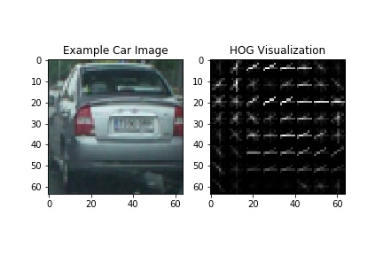
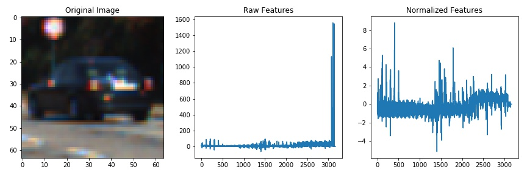

##Writeup Template
###You can use this file as a template for your writeup if you want to submit it as a markdown file, but feel free to use some other method and submit a pdf if you prefer.

---

**Vehicle Detection Project**

The goals / steps of this project are the following:

* Perform a Histogram of Oriented Gradients (HOG) feature extraction on a labeled training set of images and train a classifier Linear SVM classifier
* Optionally, you can also apply a color transform and append binned color features, as well as histograms of color, to your HOG feature vector. 
* Note: for those first two steps don't forget to normalize your features and randomize a selection for training and testing.
* Implement a sliding-window technique and use your trained classifier to search for vehicles in images.
* Run your pipeline on a video stream (start with the test_video.mp4 and later implement on full project_video.mp4) and create a heat map of recurring detections frame by frame to reject outliers and follow detected vehicles.
* Estimate a bounding box for vehicles detected.

---
###Writeup / README


## Project contents: 

- `vehicles/pipeline.py` - script for training & vehicle detection.
- `vehicles/*.py` - support scripts.
- `test_images` - test images.
- `project_video.mp4` - the original raw video from [Udacity](https://github.com/udacity/CarND-Vehicle-Detection)
- `project_video_output.mp4` - the result video.

###Histogram of Oriented Gradients (HOG)

I started by reading in all the `vehicle` and `non-vehicle` images. I use Udacity dataset of images, which come from a combination of the [GTI vehicle image database](http://www.gti.ssr.upm.es/data/Vehicle_database.html), the [KITTI vision benchmark suite](http://www.cvlibs.net/datasets/kitti/).

I then explored different color spaces and different `skimage.hog()` parameters (`orientations`, `pixels_per_cell`, and `cells_per_block`).  I grabbed random images from each of the two classes and displayed them to get a feel for what the `skimage.hog()` output looks like.

Here is an example using the `YCrCb` color space and HOG parameters of `orientations=10`, `pixels_per_cell=(8, 8)` and `cells_per_block=(2, 2)`:



####2. Explain how you settled on your final choice of HOG parameters.

I tried various combinations of parameters and finally finished with YCrCb color space.
All the parameters stored in vehicle/params.py file:

``` 
        self.color_space = 'YCrCb'  # Can be RGB, HSV, LUV, HLS, YUV, YCrCb
        self.orient = 10  # HOG orientations
        self.pix_per_cell = 8  # HOG pixels per cell
        self.cell_per_block = 2  # HOG cells per block
        self.hog_channel = 'ALL'  # Can be 0, 1, 2, or "ALL"
        self.spatial_size = (16, 16)  # Spatial binning dimensions
        self.hist_bins = 64  # Number of histogram bins
        self.spatial_feat = True  # Spatial features on or off
        self.hist_feat = True  # Histogram features on or off
        self.hog_feat = True  # HOG features on or off
```

####3. Describe how (and identify where in your code) you trained a classifier using your selected HOG features (and color features if you used them).

I trained a linear SVM using sklearn.svm.LinearSVC. I also augment data with horizontal flip. Training and testing set split in 80/20.

###Sliding Window Search

####1. Describe how (and identify where in your code) you implemented a sliding window search.  How did you decide what scales to search and how much to overlap windows?


I use Udacity algorithm for sliding window search. In purpose of some performance optimizations and to prevent false positives I localized search with ~ bottom half of window. In future this methodology may enhanced with ROI from Advanced Lane Finding algorithms.

####2. Show some examples of test images to demonstrate how your pipeline is working.  What did you do to optimize the performance of your classifier?




I use heatmap filtering using technique proposed in lecture video. Heatmap results:


---

### Video Implementation

####1. Provide a link to your final video output.  Your pipeline should perform reasonably well on the entire project video (somewhat wobbly or unstable bounding boxes are ok as long as you are identifying the vehicles most of the time with minimal false positives.)
Here's a [link to my video result](./project_video_output.mp4)

####2. Describe how (and identify where in your code) you implemented some kind of filter for false positives and some method for combining overlapping bounding boxes.

I recorded the positions of positive detections in each frame of the video.  From the positive detections I created a heatmap and then thresholded that map to identify vehicle positions.  I then used `scipy.ndimage.measurements.label()` to identify individual blobs in the heatmap.  I then assumed each blob corresponded to a vehicle.  I constructed bounding boxes to cover the area of each blob detected.  

---

###Discussion

####1. Briefly discuss any problems / issues you faced in your implementation of this project.  Where will your pipeline likely fail?  What could you do to make it more robust?

Here I'll talk about the approach I took, what techniques I used, what worked and why, where the pipeline might fail and how I might improve it if I were going to pursue this project further.  

There is several issues: 
1. Results far from ideal when few cars overlaps each other.
2. False positives.
3. Performance. Current pipeline is very slow, it certainly not appropriate for real time use.

What can be improved:
1. More fine-tuning of HOG parameters.
2. Currently I doesn't store history of car localizations, only current and previous state. Theoretically it may give more stable results.
3. There is a space for improvement in ROI. Current algorithm quite inaccurate. Integration ROI from Advanced Lane Finding should improve the results.
4. More data augmentation (rotations, shadows, different light conditions).


